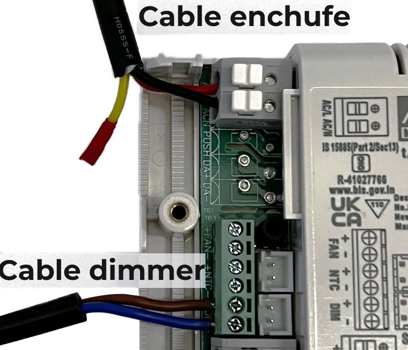

##Etapa 2: Conexiones al driver

En esta etapa conectarás el cable AC del enchufe al driver y el dimmer al driver, como
muestra este diagrama:

Como podrás notar, el cable amarillo queda libre, así que le pondremos cinta aislante por
seguridad, aunque luego le pondremos la tapa al driver de igual manera. Luego de construir
el módulo LED en la siguiente etapa, lo conectaremos al driver en la etapa 4.