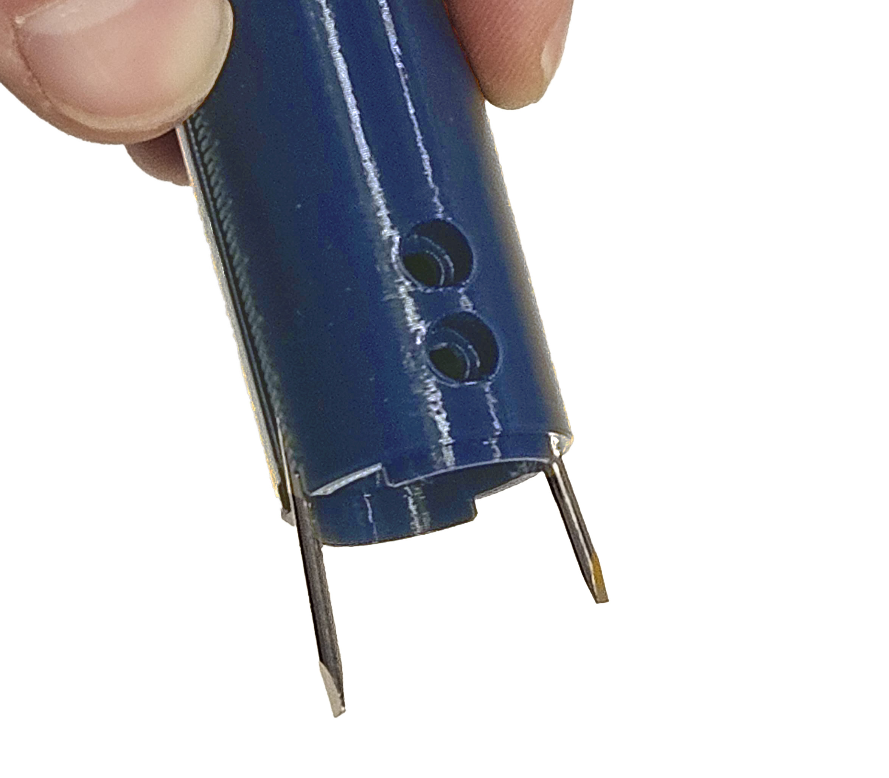
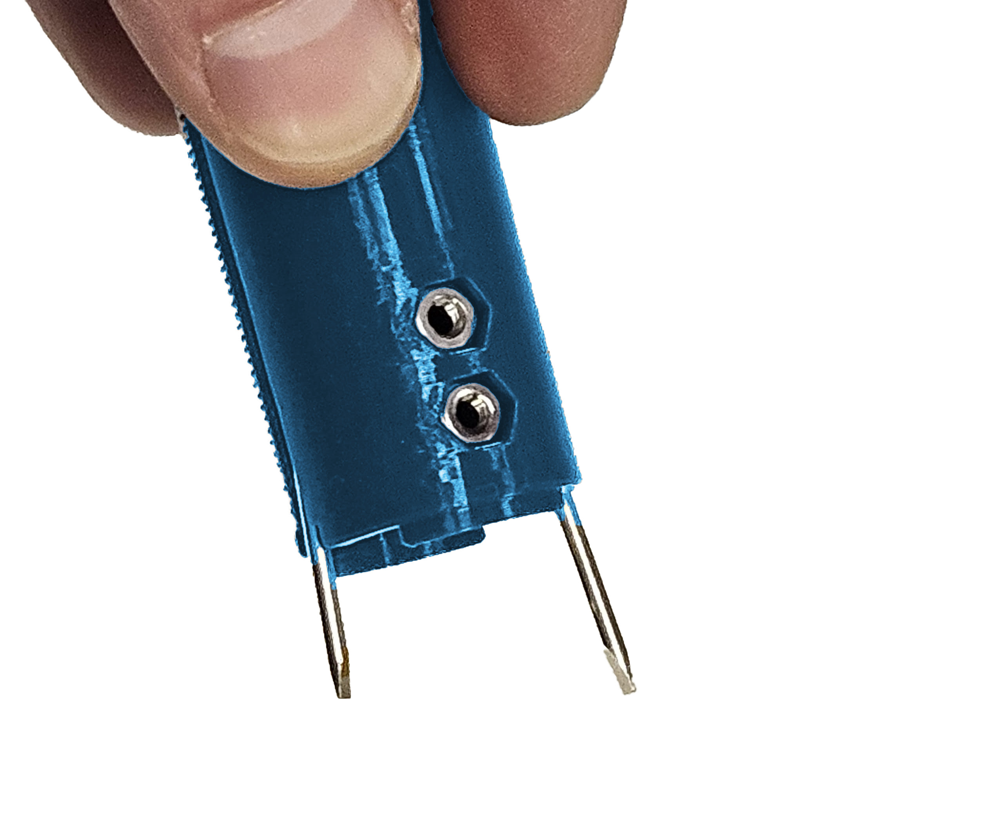
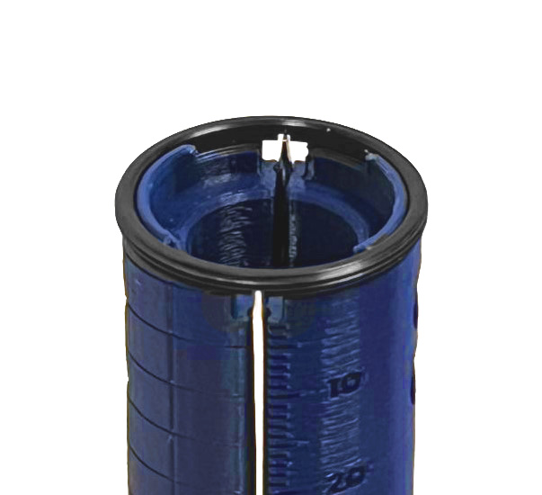

##Etapa 3: Construir herramienta para asegurar elementos ópticos

Para esta etapa necesitarás el tubo de plástico dispuesto en el kit, la bolsa de tornillos y
tuercas M3, los dos atornilladores pequeños, y una llave allen 2.5 mm.

Esta herramienta servirá para enroscar anillos sujetadores dentro del tubo óptico metálico.
Es una alternativa barata a una herramienta comercial de precisión que tiene un costo más
elevado. Esta herramienta es de plástico con unos pines metálicos que permiten enroscar los
anillos.

En primer lugar, se debe romper el mango plástico de los atornilladores para dejar expuestos
los pines de metal, que se introducen en guías especiales en la punta del tubo plástico.

Luego, se debe posicionar las tuercas y luego los tornillos, enroscándolos lo mínimo posible
para sostener los pines de metal en su lugar sin apretarlos. Para posicionar los pines de
metal, deben girarse en su lugar hasta que las dos paletas estén alineadas.

El siguiente paso es empujar los pines hacia adentro hasta que sobresalgan unos milímetros.
Para ajustar su altura exacta, usar la ranura de un anillo con hilo para empujarlo hasta el
tope. De esta forma el pin sobresale exactamente la profundidad de la ranura. Repetir el
ajuste con el otro pin.

Finalmente sin mover los pines, apretar de a poco los pernos por turnos, hasta que la punta
de la herramienta sea circular y encaje con el anillo.

