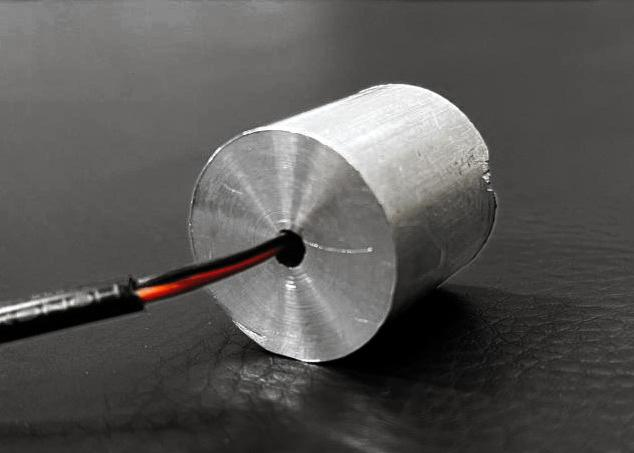
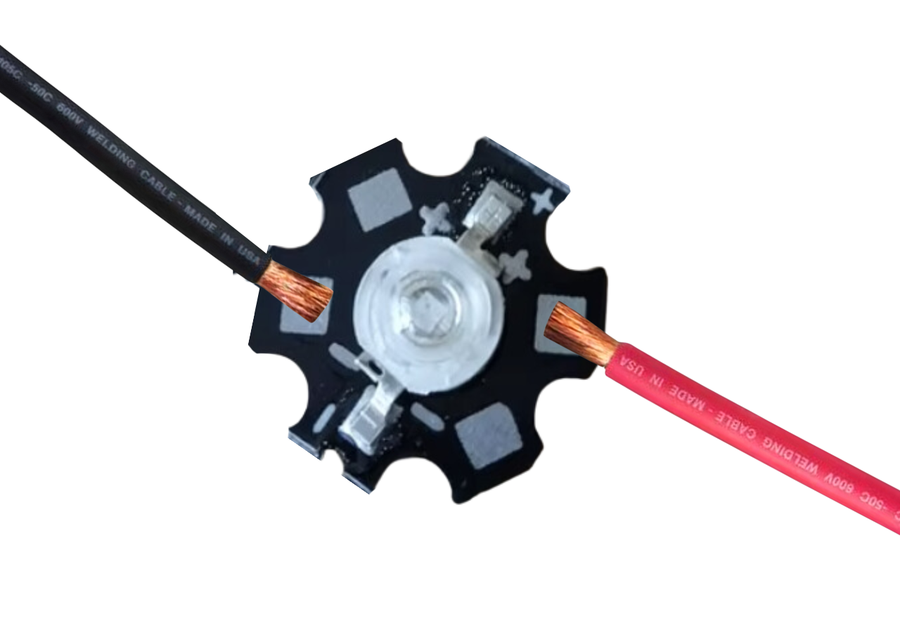
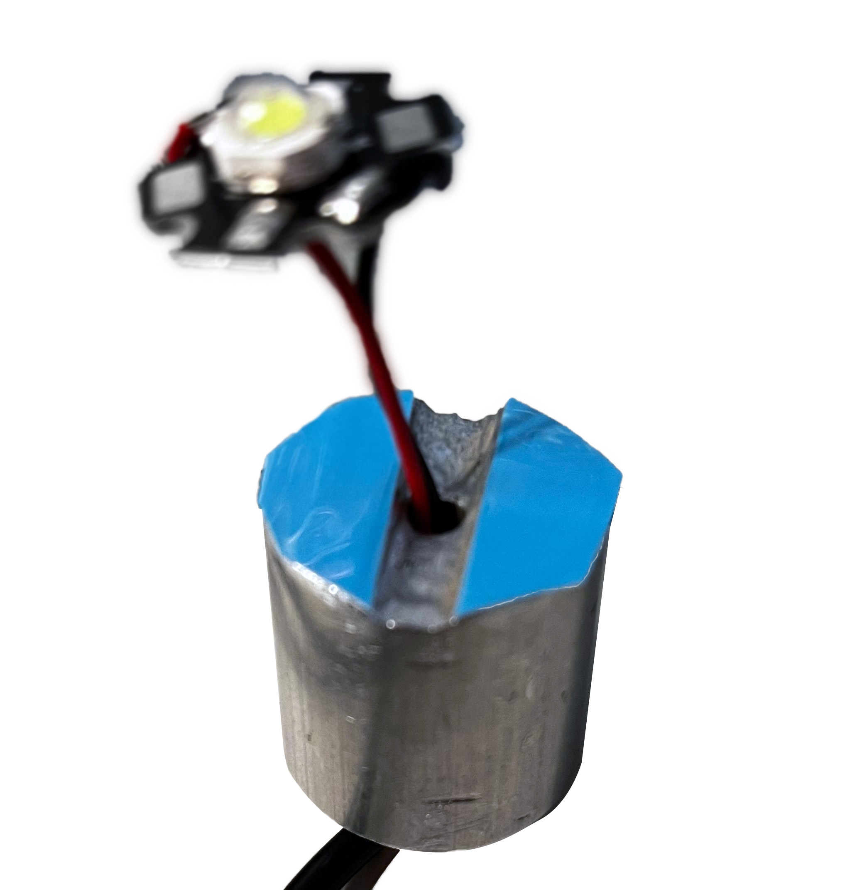
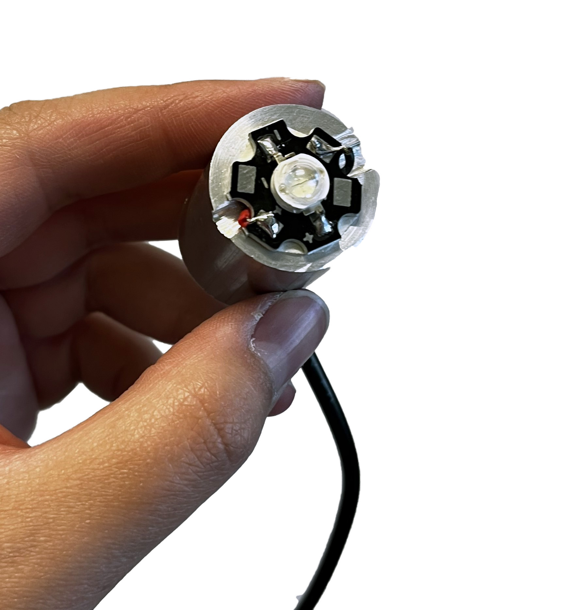
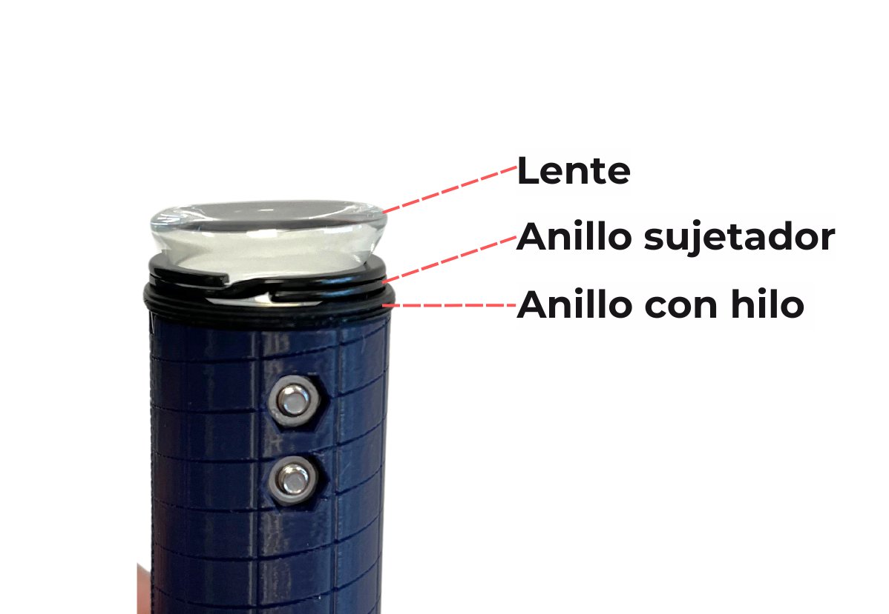

##Etapa 4: Construir el módulo LED

Para esta etapa necesitaras pelar el cable más delgado por ambos extremos. En uno dejarás
aproximadamente 2 centímetros expuestos de los cables rojo y negro que están dentro,
exponiendo sus conductores para conectarlos al driver posteriormente. En el otro extremo,
dejarás 5 centímetros y con el conductor expuesta. Este último extremo es el que debes
introducir a la perforación del disipador de calor.

Luego, vamos a soldar el LED a los cables que sobresalen del disipador. **Es muy importante
que respetes la polaridad al momento de soldar**, siguiendo este diagrama (rojo =
positivo; negro = negativo).

Para soldar los cables necesitarás un cautín y estaño, los cuales te brindaremos en ese
momento.

Una vez soldado el LED, debes pegar la cinta termoconductora azul de doble contacto al
disipador, para luego pegar el LED. Para ello, cortarás dos pedazos con la forma que
sobresale fuera de la ranura del disipador, tal como se indica en la siguiente foto:

Luego debes **posicionar el LED en el centro**, pegarlo y presionar con fuerza, hasta tener
seguridad de que está bien unido al disipador.

Posteriormente, debes introducir todo este componente en el tubo, para luego afirmarlo con un anillo.

Para ello, debes posicionar el anillo en los topes de la herramienta que construiste en la
segunda etapa, introducirlo en el tubo y atornillar apretando (en sentido horario) hasta que
la herramienta marque 33 mm de profundidad.

Verifica que, al mover el tubo, no haya movimiento de los componentes que están dentro.

Una vez asegurado el disipador, debes atornillar otro anillo hasta una profundidad de 20 mm
de profundidad.

Luego, posicionarás en la herramienta atornilladora un anillo, un anillo separador y un lente,
con el lado convexo (redondo) hacia abajo.

Luego manteniendo la herramienta en su posición vertical con el lente encima, se debe
enroscar el tubo por encima de ella, hasta llegar a una profundidad de 16 mm.

Verifica que, al mover el tubo, no haya movimiento de los componentes que están dentro.