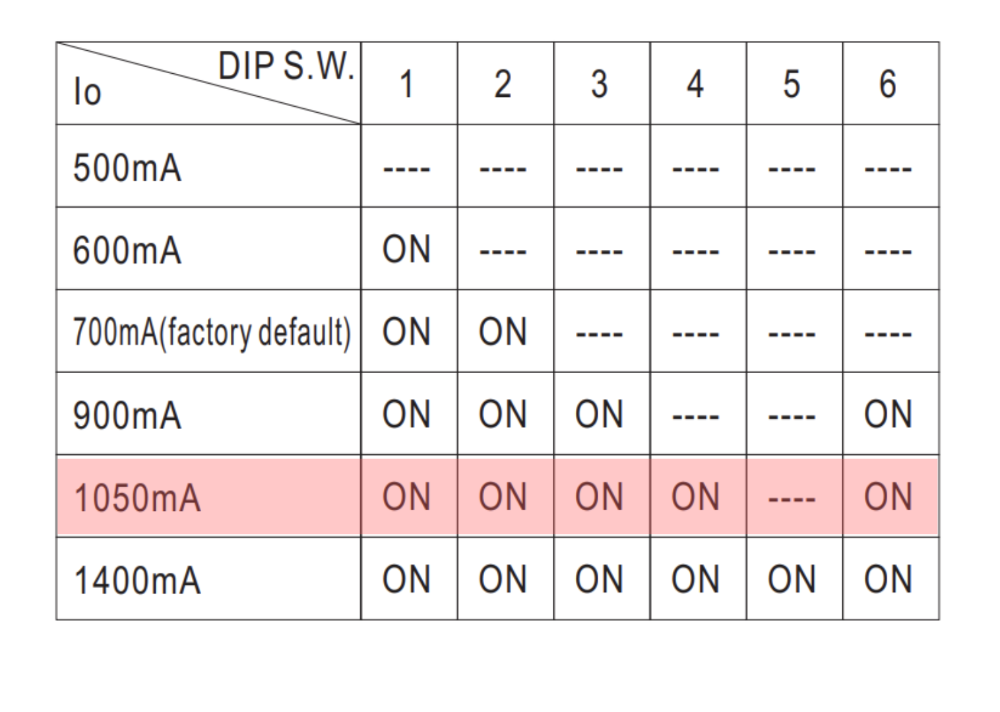
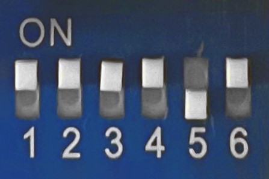

##Etapa 6: Configurar el driver

Con el objetivo de estudiar el comportamiento de los LEDs a 1 Ampere, debes configurar los
switches del driver para lograr esta corriente máxima, siguiendo este diagrama:

