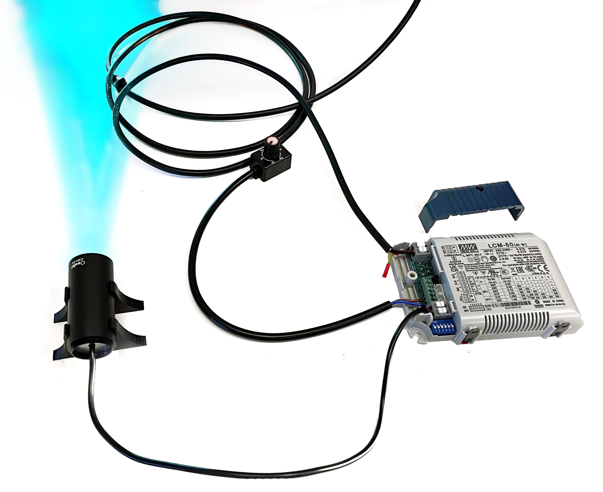

###Etapa 7: Conexión AC y pruebas de enfoque

Luego de verificar que todos los componentes estén bien conectados, enchufaremos el driver
a la corriente y encenderemos el led con la perilla del dimmer. Es recomendable apuntar la
luz hacia la pantalla de cartón para no causar molestias a otros grupos de trabajo que puedan
estar cerca.
¡Listo! Ahora estás listo para probar tu módulo LED

